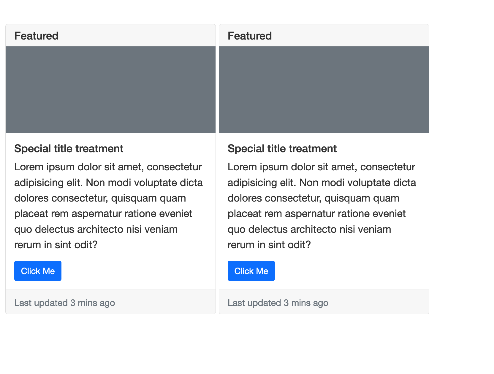
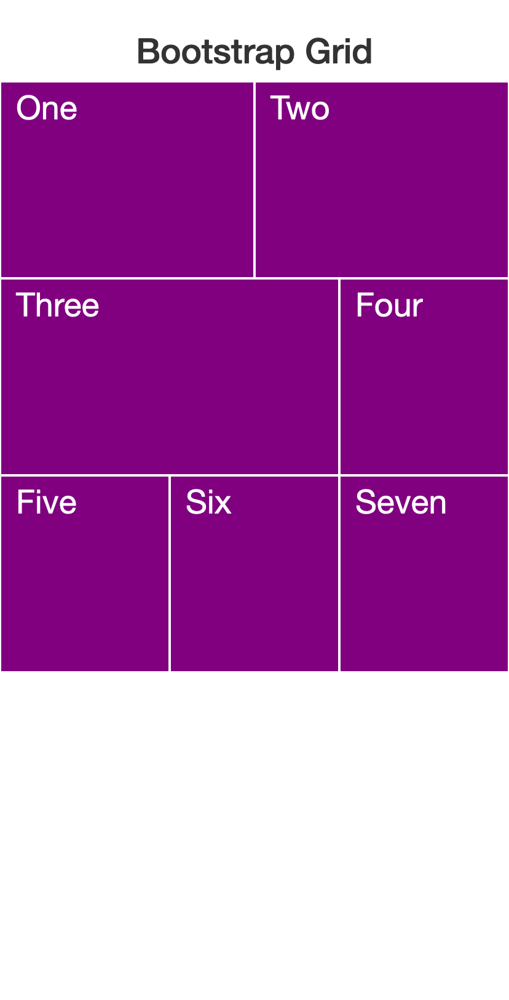
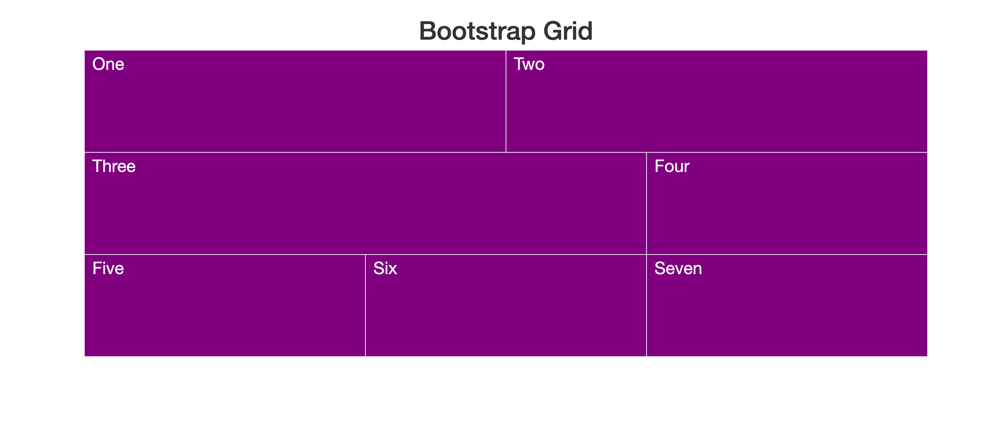
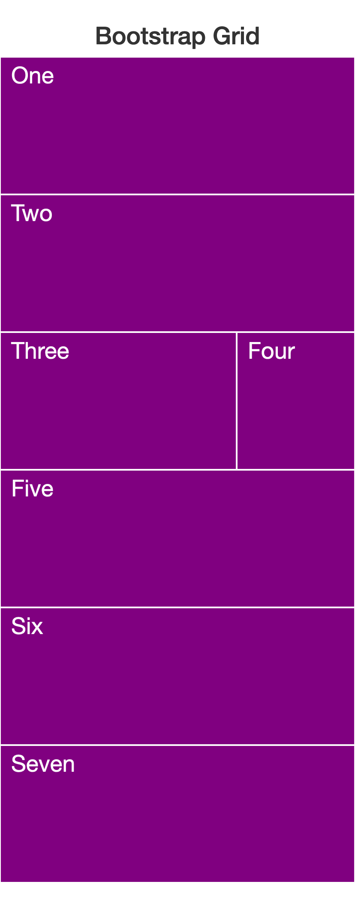
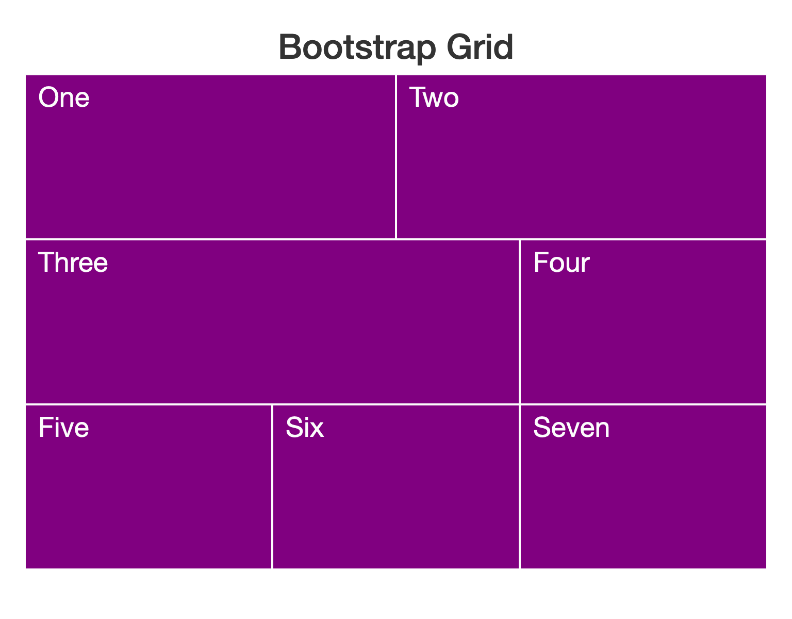
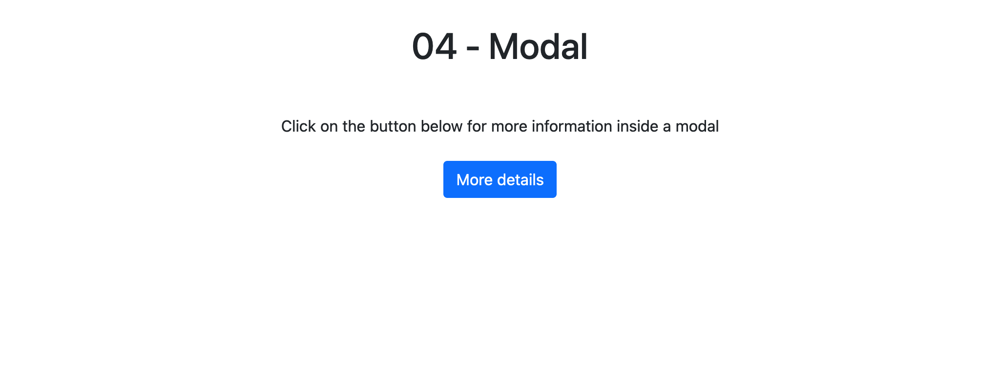
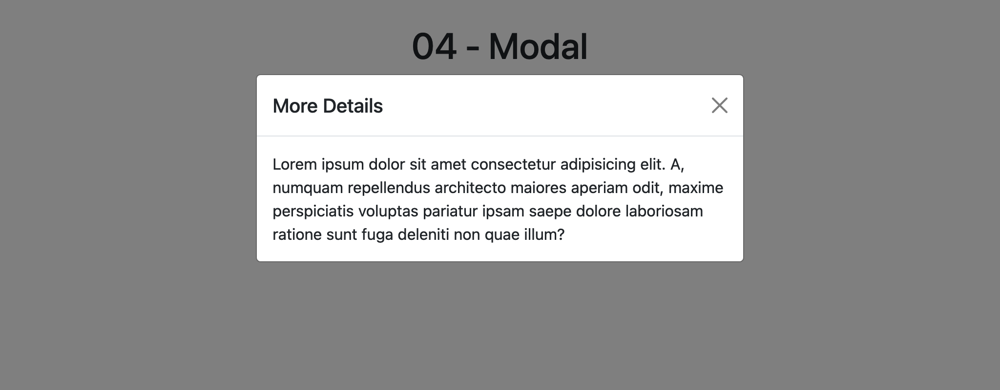

# Bootstrap Exercises

- [Exercise 01 - Cards](#ex01)
- [Exercise 02 - Grid](#ex02)
- [Exercise 03 - Grid](#ex03)
- [Exercise 04 - Modals](#ex04)

##  Exercise 01 - Cards

Recreate the layout below using the Boostrap card classes.

##  Exercise 02 - Grid

Recreate the layout below using the Boostrap grid.

##  Exercise 03 - Grid

Recreate the layout below using the Boostrap grid and the media queries available within the grid classes.

##  Exercise 04 - Modals

Recreate the layout below using the Boostrap modal classes.

