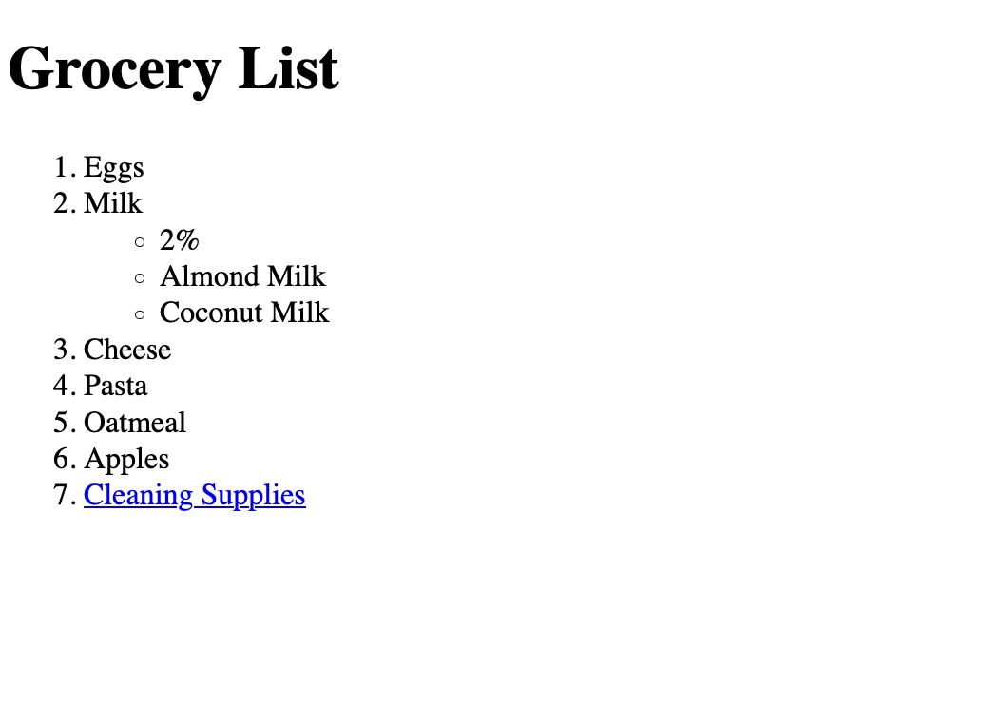
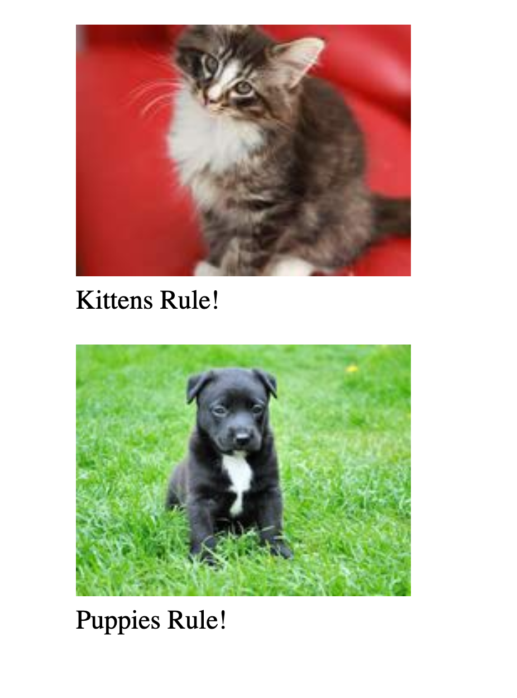
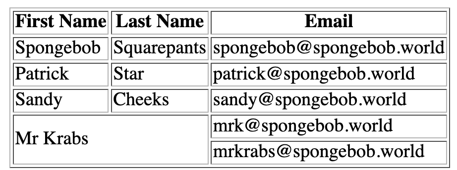
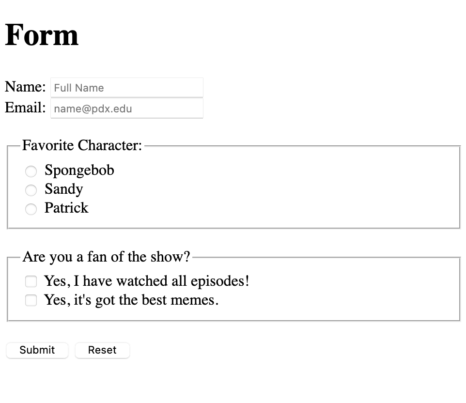

# HTML Exercises

- [Exercise 01 - Lists](#ex01)
- [Exercise 02 - Images](#ex02)
- [Exercise 03 - Table](#ex03)
- [Exercise 04 - Form](#ex04)

##  Exercise 01 - Lists

Recreate the snapshot below, using ordered and unordered lists and an anchor element for navigation.

##  Exercise 02 - Images

Recreate the snapshot below, using two images (200x150) from [placekitten](http://placekitten.com/) and [placepuppy](https://place-puppy.com/). Make sure you add captions below the image using `figure` and `figcaption`. Every non-decorate image should have an "alt" attribute describing the contents of the image.

##  Exercise 03 - Table

Create a `table`, using `thead` and `tbody`, as well as colspan and rowspan.

##  Exercise 04 - Form

Create a form that uses input elements of type name, email, radio, checkbox, and more.

