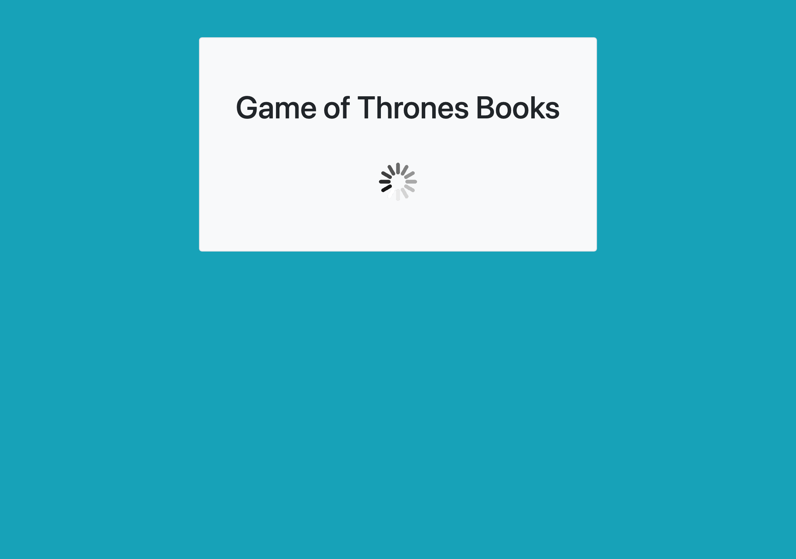
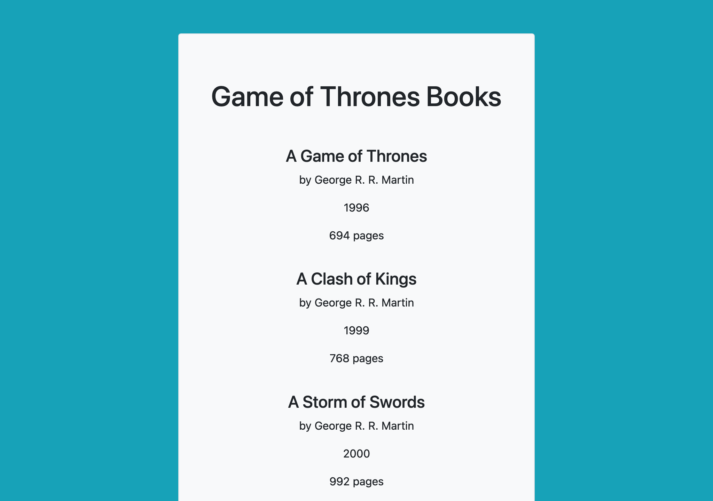

# jQuery Exercises

- [Exercise 01 - DOM](#ex01)
- [Exercise 02 - Fetch](#ex02)

##  Exercise 01 - DOM

Take in user input and output that data back to the output elements in the DOM. Use jQuery to rewrite this exercise.

Part 1 - When the user clicks the 'copy' button, copy the user input to the output area. Fetch the JavaScript objects representing specific elements in the DOM. Add an event listener on the target element. Write a callback function to handle the 'click' event.

Part 2 - When the user enters input text, copy the user input to the output area. Fetch the JavaScript objects representing specific elements in the DOM. Add an event listener on the target element. Write a callback function to handle the 'input' event.

##  Exercise 02 - Fetch

Fetch all books from the API of Ice and Fire and append them to the DOM. Use jQuery to rewrite this exercise; you will need to make the HTTP request, create elements in the DOM, append elements, and style those elements.

